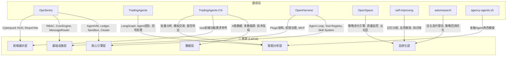
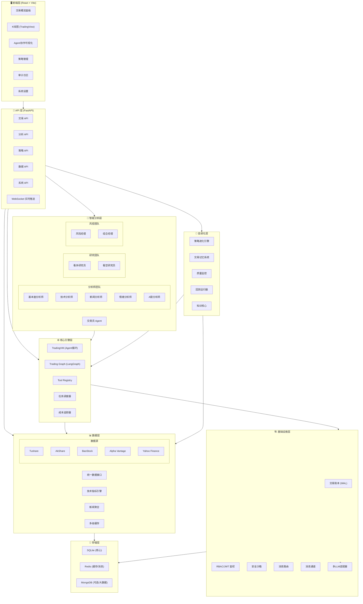
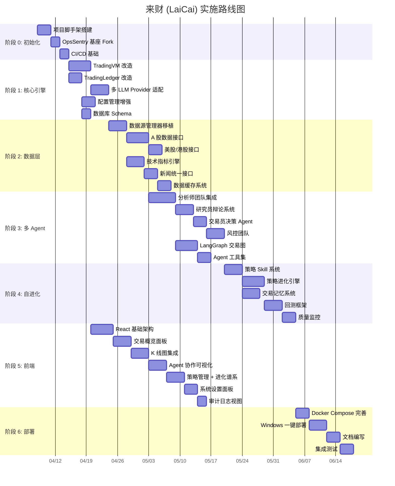
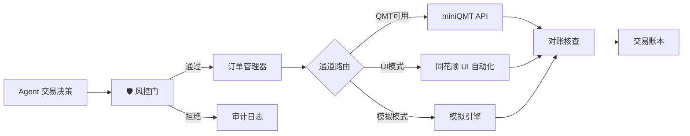

# 🐉 来财 (Attract-wealth) — AI 驱动量化交易客户端改造方案

> **基座**: OpsSentry | **融合**: 工作区全部 8 个开源项目  
> **仓库**: [github.com/btnalit/Attract-wealth](https://github.com/btnalit/Attract-wealth)  
> **目标**: 支持 Windows 本地部署 + Docker 容器化部署的量化交易客户端（含同花顺实盘交易）

---

## 1. 项目总览

### 1.1 产品定位

**"来财"** 是一个 AI 原生的量化交易研究与分析客户端，融合了：
- 🏭 **OpsSentry** 的生产级基础设施（高可用、审计、沙箱、集群）
- 🤖 **TradingAgents** 的多 Agent 协作交易决策框架
- 🇨🇳 **TradingAgents-CN** 的完整 A 股支持与企业级功能
- 🔧 **OpenHarness** 的 Agent 基础设施（43+ 工具、Skill 系统、Plugin 架构）
- 🧬 **OpenSpace** 的自进化引擎（策略自动学习、优化、共享）
- 🧠 **self-improving** 的记忆分层与知识管理
- 🔬 **autoresearch** 的自主策略迭代理念
- 📋 **agency-agents-zh** 的金融 Agent 角色模板

### 1.2 核心价值

| 维度 | 能力 | 来源 |
|------|------|------|
| **可靠性** | 交易审计总线 11k+ rec/s、分布式故障转移 | OpsSentry |
| **智能性** | 5 类分析师 + 多空辩论 + 风控团队协作 | TradingAgents |
| **本土化** | A 股/港股完整支持、多数据源、中文 UI | TradingAgents-CN |
| **进化性** | 策略自动修复/改进/学习、质量监控 | OpenSpace |
| **记忆性** | HOT/WARM/COLD 三层知识沉淀 | self-improving |
| **可扩展** | 43+ 工具、Plugin 生态、MCP 协议 | OpenHarness |
| **易部署** | Windows 一键 + Docker Compose | 综合 |

---

## 2. 源项目分析与功能提取

### 2.1 各项目功能映射



### 2.2 各源项目提取清单

#### 📦 OpsSentry (基座 — 保留改造)

| 源模块 | 目标模块 | 改造内容 |
|--------|----------|----------|
| `agent_vm.py` | `core/trading_vm.py` | Think-Act-Observe → 集成 LangGraph 状态机 |
| `ops_ledger.py` | `core/trading_ledger.py` | 扩展交易字段: ticker, action, price, qty, P&L |
| `sqlite_ledger_storage.py` | `core/storage.py` | 增加交易表、策略表、账户表 Schema |
| `tool_registry.py` | `core/tool_registry.py` | 融合 OpenHarness 的 Pydantic 验证 + 自描述 Schema |
| `config_shield.py` | `core/config_shield.py` | 增加 LLM/数据源/风控参数配置 |
| `sandbox.py` | `core/sandbox.py` | 保留安全沙箱,用于策略代码执行 |
| `cron_engine.py` | `core/scheduler.py` | 定时策略 + 开盘前分析 + 收盘后总结 |
| `knowledge_core.py` | `evolution/knowledge_core.py` | 扩展为交易知识库 |
| `session_manager.py` | `core/session_manager.py` | 保留,增加交易会话上下文 |
| `auth.py` | `core/auth.py` | 保留 RBAC/JWT |
| `message_router.py` | `core/message_router.py` | 保留跨节点通信 |
| `channels/` | `channels/` | 保留飞书/Slack + 新增微信/钉钉 |
| `cluster/` | `cluster/` | 保留分布式能力(可选) |
| `frontend/` | `frontend/` | 保留 React/Vite 基座,重构为交易 UI |
| `routers/` | `routers/` | 重构为交易 API |

#### 📦 TradingAgents (原版 — 提取核心)

| 源模块 | 目标模块 | 提取内容 |
|--------|----------|----------|
| `tradingagents/graph/trading_graph.py` | `graph/trading_graph.py` | LangGraph 多 Agent 协作图核心 |
| `tradingagents/graph/signal_processing.py` | `graph/signal_processing.py` | 信号处理逻辑 |
| `tradingagents/graph/reflection.py` | `graph/reflection.py` | Agent 反思机制 |
| `tradingagents/graph/conditional_logic.py` | `graph/conditional_logic.py` | 条件分支路由 |
| `tradingagents/default_config.py` | `config/trading_defaults.py` | 默认配置模板 |
| `tradingagents/llm_clients/` | `llm/providers/` | 多 LLM Provider 客户端 |

#### 📦 TradingAgents-CN (中文增强 — 大量移植)

| 源模块 | 目标模块 | 提取内容 |
|--------|----------|----------|
| `agents/analysts/fundamentals_analyst.py` | `agents/analysts/fundamentals.py` | 基本面分析师(含 A 股) |
| `agents/analysts/market_analyst.py` | `agents/analysts/technical.py` | 技术分析师 |
| `agents/analysts/news_analyst.py` | `agents/analysts/news.py` | 新闻分析师 |
| `agents/analysts/social_media_analyst.py` | `agents/analysts/sentiment.py` | 情绪分析师 |
| `agents/analysts/china_market_analyst.py` | `agents/analysts/china_market.py` | A 股专用分析师 |
| `agents/researchers/` | `agents/researchers/` | 多空辩论研究员 |
| `agents/trader/` | `agents/traders/` | 交易决策 Agent |
| `agents/risk_mgmt/` | `agents/risk_mgmt/` | 风险管理团队 |
| `dataflows/interface.py` | `dataflows/interface.py` | 统一数据接口(77KB 核心) |
| `dataflows/optimized_china_data.py` | `dataflows/china_data.py` | A 股优化数据(116KB) |
| `dataflows/data_source_manager.py` | `dataflows/source_manager.py` | 数据源管理器 |
| `dataflows/providers/` | `dataflows/providers/` | Tushare/AkShare/BaoStock |
| `dataflows/technical/` | `dataflows/technical/` | 技术指标计算 |
| `dataflows/news/` | `dataflows/news/` | 新闻数据处理 |
| `tools/unified_news_tool.py` | `dataflows/news/unified.py` | 统一新闻工具 |
| `llm_adapters/` | `llm/adapters/` | LLM 适配器 |
| `graph/trading_graph.py` | `graph/trading_graph.py` | 增强版交易图(67KB) |

#### 📦 OpenHarness (Agent 基础设施 — 模式移植)

| 源模式 | 目标模块 | 移植内容 |
|--------|----------|----------|
| `engine/` Agent Loop 模式 | `core/trading_vm.py` | 流式 Tool-Call + 并行执行 + 自动重试 |
| `tools/` 43+ 工具注册模式 | `core/tool_registry.py` | Pydantic 验证 + 自描述 Schema + 权限集成 |
| `skills/` Skill 加载模式 | `evolution/skill_engine.py` | 按需 .md 文件加载为策略 |
| `plugins/` Plugin 架构 | `plugins/` | 命令 + Hooks + 子 Agent 扩展 |
| `permissions/` 权限治理 | `core/permissions.py` | 多级权限模式 + 路径规则 |
| `mcp/` MCP 协议 | `mcp/` | MCP 客户端/服务端 |
| `hooks/` 生命周期钩子 | `core/hooks.py` | PreToolUse/PostToolUse 事件 |
| `coordinator/` 多 Agent 协调 | `core/coordinator.py` | 子 Agent 生成 + 团队管理 |
| Token 计数/成本追踪 | `core/cost_tracker.py` | LLM 调用成本实时追踪 |

#### 📦 OpenSpace (自进化 — 核心移植)

| 源模块 | 目标模块 | 移植内容 |
|--------|----------|----------|
| `skill_engine/registry.py` | `evolution/skill_registry.py` | 策略发现 + BM25+Embedding 预筛 + LLM 选择 |
| `skill_engine/evolver.py` | `evolution/strategy_evolver.py` | FIX/DERIVED/CAPTURED 三模式进化 |
| `skill_engine/analyzer.py` | `evolution/post_analysis.py` | 交易后分析 + 工具访问 |
| `skill_engine/store.py` | `evolution/strategy_store.py` | SQLite 持久化 + 版本 DAG + 质量指标 |
| `skill_engine/patch.py` | `evolution/patcher.py` | 多文件 DIFF/PATCH 应用 |
| `grounding/core/quality/` | `evolution/quality_monitor.py` | 工具质量追踪 + 级联进化 |
| `cloud/` | `evolution/cloud/` | 策略社区共享(可选) |
| `dashboard_server.py` | 集成到主 API | 进化仪表盘 API |

#### 📦 self-improving (记忆系统 — 完整移植)

| 源概念 | 目标模块 | 移植内容 |
|--------|----------|----------|
| HOT/WARM/COLD 分层 | `evolution/memory_manager.py` | 交易记忆三层架构 |
| OODA 反思框架 | `evolution/reflector.py` | 交易后自动反思 |
| 知识提炼 | `evolution/knowledge_core.py` | 交易模式自动提取 |
| 敏感度触发器 | `evolution/triggers.py` | 基于交易结果触发进化 |

#### 📦 autoresearch (理念移植)

| 源理念 | 目标实现 | 应用方式 |
|--------|----------|----------|
| 自主实验循环 | `evolution/backtest_runner.py` | 策略参数自动优化循环 |
| program.md 驱动 | `.md 策略定义` | 策略以 Markdown Skill 形式定义 |
| 固定预算评估 | `evolution/evaluator.py` | 固定时间/资金预算的策略评估 |

#### 📦 agency-agents-zh (角色模板)

| 源模板 | 目标使用 | 应用方式 |
|--------|----------|----------|
| `finance-financial-forecaster.md` | 分析师 Prompt 增强 | 融入基本面分析师的系统提示词 |
| `finance-fraud-detector.md` | 风控 Agent 增强 | 融入风险管理的异常检测能力 |
| `finance-invoice-manager.md` | 参考 | 结构化数据处理模式参考 |

---

## 3. 技术架构设计

### 3.1 整体架构



### 3.2 技术选型统一

| 层级 | 技术选择 | 选型理由 |
|------|----------|----------|
| **后端框架** | FastAPI | OpsSentry/TradingAgents-CN 均使用，异步高性能 |
| **前端框架** | React 18 + Vite | OpsSentry 已有 Cyberpunk HUD 基座，OpenHarness 也用 React |
| **前端样式** | TailwindCSS | OpsSentry 已集成，效率高 |
| **AI 编排** | LangGraph | TradingAgents 核心图引擎，状态机模式 |
| **LLM 适配** | LiteLLM | OpsSentry 已集成，统一 100+ 模型接入 |
| **核心数据库** | SQLite (WAL) | OpsSentry 已验证 11k+ QPS，Windows 零配置 |
| **缓存层** | Redis (可选) | 行情缓存 + 消息队列 + 会话存储 |
| **大数据存储** | MongoDB (可选) | 历史 K 线/新闻大数据量场景 |
| **向量库** | LanceDB | self-improving 已使用，知识语义搜索 |
| **K 线图表** | TradingView Lightweight Charts | 业界标准，轻量开源 |
| **Agent 图可视化** | React Flow | LangGraph 状态流程渲染 |
| **图表库** | Recharts | React 生态，Dashboard 数据面板 |
| **定时任务** | APScheduler | OpsSentry 已集成 |
| **WebSocket** | FastAPI WebSocket | 实时推送 Agent 进度/行情 |
| **打包部署** | PyInstaller / Docker | Windows 独立可执行 + Docker 容器 |
| **包管理** | uv | 现代 Python 包管理，极速 |

### 3.3 项目目录结构

```
LaiCai/
├── src/
│   ├── __init__.py
│   ├── main.py                        # FastAPI 应用入口
│   │
│   ├── core/                          # ⚙️ 核心引擎 (← OpsSentry 基座)
│   │   ├── trading_vm.py              #   交易 VM (agent_vm + LangGraph)
│   │   ├── trading_ledger.py          #   交易账本 (ops_ledger 扩展)
│   │   ├── storage.py                 #   SQLite WAL 存储层
│   │   ├── tool_registry.py           #   工具注册 (+ OpenHarness 增强)
│   │   ├── config_shield.py           #   配置守护 (扩展交易配置)
│   │   ├── sandbox.py                 #   安全沙箱 (策略代码执行)
│   │   ├── scheduler.py               #   定时任务 (开盘/收盘/策略)
│   │   ├── session_manager.py         #   会话管理 (交易上下文)
│   │   ├── auth.py                    #   RBAC/JWT 鉴权
│   │   ├── permissions.py             #   权限治理 (← OpenHarness)
│   │   ├── hooks.py                   #   生命周期钩子
│   │   ├── coordinator.py             #   多 Agent 协调器
│   │   ├── cost_tracker.py            #   LLM 成本追踪
│   │   ├── message_router.py          #   消息路由
│   │   └── dependencies.py            #   FastAPI 依赖注入
│   │
│   ├── agents/                        # 🤖 多 Agent 体系 (← TradingAgents)
│   │   ├── __init__.py
│   │   ├── base.py                    #   Agent 基类
│   │   ├── analysts/                  #   📊 分析师团队
│   │   │   ├── fundamentals.py        #     基本面分析师
│   │   │   ├── technical.py           #     技术分析师
│   │   │   ├── news.py                #     新闻分析师
│   │   │   ├── sentiment.py           #     情绪分析师
│   │   │   └── china_market.py        #     A 股专用分析师
│   │   ├── researchers/               #   🔬 研究员团队
│   │   │   ├── bull.py                #     看多研究员
│   │   │   └── bear.py                #     看空研究员
│   │   ├── traders/                   #   💰 交易决策
│   │   │   └── trader.py              #     交易员 Agent
│   │   └── risk_mgmt/                 #   🛡️ 风控团队
│   │       ├── risk_manager.py        #     风险经理
│   │       └── portfolio_mgr.py       #     组合经理
│   │
│   ├── graph/                         # 🔀 LangGraph 协作图
│   │   ├── trading_graph.py           #   主交易决策图
│   │   ├── signal_processing.py       #   信号聚合处理
│   │   ├── conditional_logic.py       #   条件路由逻辑
│   │   ├── reflection.py              #   Agent 反思机制
│   │   └── propagation.py             #   决策传播
│   │
│   ├── dataflows/                     # 📊 数据层 (← TradingAgents-CN)
│   │   ├── interface.py               #   统一数据接口
│   │   ├── source_manager.py          #   数据源管理器
│   │   ├── china_data.py              #   A 股优化数据
│   │   ├── providers/                 #   数据源适配器
│   │   │   ├── tushare_provider.py    #     Tushare
│   │   │   ├── akshare_provider.py    #     AkShare
│   │   │   ├── baostock_provider.py   #     BaoStock
│   │   │   ├── alphavantage.py        #     Alpha Vantage
│   │   │   └── yahoo_finance.py       #     Yahoo Finance
│   │   ├── technical/                 #   技术指标计算
│   │   │   ├── indicators.py          #     MACD/RSI/KDJ/布林...
│   │   │   └── patterns.py            #     形态识别
│   │   ├── news/                      #   新闻数据
│   │   │   ├── unified.py             #     统一新闻工具
│   │   │   └── filters.py             #     新闻质量过滤
│   │   └── cache/                     #   多级缓存
│   │       ├── redis_cache.py         #     Redis 缓存
│   │       └── sqlite_cache.py        #     SQLite 缓存
│   │
│   ├── evolution/                     # 🧬 自进化系统
│   │   ├── skill_engine.py            #   策略技能引擎 (← OpenSpace)
│   │   ├── skill_registry.py          #   策略发现 (BM25+Embedding)
│   │   ├── strategy_evolver.py        #   策略进化器 (FIX/DERIVED/CAPTURED)
│   │   ├── strategy_store.py          #   策略持久化 + 版本 DAG
│   │   ├── post_analysis.py           #   交易后分析
│   │   ├── patcher.py                 #   策略 DIFF/PATCH
│   │   ├── memory_manager.py          #   交易记忆 (HOT/WARM/COLD)
│   │   ├── reflector.py               #   自动反思 (← self-improving)
│   │   ├── knowledge_core.py          #   知识库 (LanceDB)
│   │   ├── backtest_runner.py         #   回测运行器 (← autoresearch)
│   │   ├── quality_monitor.py         #   策略质量监控
│   │   ├── evaluator.py               #   固定预算评估器
│   │   ├── triggers.py                #   进化触发器
│   │   └── cloud/                     #   策略社区(可选)
│   │       ├── client.py
│   │       └── search.py
│   │
│   ├── llm/                           # 🤖 LLM 适配层
│   │   ├── adapter.py                 #   统一适配器 (LiteLLM)
│   │   ├── cost_calculator.py         #   成本计算
│   │   └── providers/                 #   Provider 特化
│   │       ├── openai_provider.py
│   │       ├── deepseek_provider.py
│   │       ├── qwen_provider.py
│   │       ├── kimi_provider.py
│   │       └── ollama_provider.py
│   │
│   ├── channels/                      # 📢 消息通道 (← OpsSentry)
│   │   ├── feishu.py                  #   飞书
│   │   ├── slack.py                   #   Slack
│   │   ├── wechat.py                  #   企业微信(新增)
│   │   └── dingtalk.py                #   钉钉(新增)
│   │
│   ├── plugins/                       # 🔌 Plugin 系统 (← OpenHarness)
│   │   ├── loader.py                  #   Plugin 加载器
│   │   └── built_in/                  #   内置 Plugin
│   │
│   ├── mcp/                           # 🌐 MCP 协议 (← OpenHarness)
│   │   ├── server.py                  #   MCP Server
│   │   └── client.py                  #   MCP Client
│   │
│   ├── cluster/                       # 🌍 分布式 (← OpsSentry, 可选)
│   │   ├── gossip.py
│   │   └── lease.py
│   │
│   ├── routers/                       # 🔌 FastAPI 路由
│   │   ├── trading.py                 #   交易相关 API
│   │   ├── analysis.py                #   分析相关 API
│   │   ├── strategy.py                #   策略管理 API
│   │   ├── data.py                    #   数据查询 API
│   │   ├── evolution.py               #   进化系统 API
│   │   ├── system.py                  #   系统状态 API
│   │   ├── auth.py                    #   认证 API
│   │   └── websocket.py               #   WebSocket 推送
│   │
│   └── frontend/                      # 🖥️ React 前端
│       ├── index.html
│       ├── package.json
│       ├── vite.config.ts
│       ├── tailwind.config.js
│       └── src/
│           ├── App.tsx
│           ├── main.tsx
│           ├── pages/
│           │   ├── Dashboard/         #   交易概览
│           │   ├── Analysis/          #   分析面板
│           │   ├── Chart/             #   K线图
│           │   ├── AgentFlow/         #   Agent 协作可视化
│           │   ├── Strategy/          #   策略管理 + 进化谱系
│           │   ├── Backtest/          #   回测结果
│           │   ├── Simulation/        #   模拟交易
│           │   ├── AuditLog/          #   审计日志
│           │   └── Settings/          #   系统设置
│           ├── components/
│           │   ├── CyberpunkHUD/      #   赛博朋克风格组件
│           │   ├── TradingChart/      #   K线图组件
│           │   ├── AgentCard/         #   Agent 卡片
│           │   ├── EvolutionTree/     #   进化谱系树
│           │   └── StatusPulse/       #   状态脉冲动画
│           └── hooks/
│
├── skills/                            # 📚 交易策略技能库
│   ├── built-in/                      #   内置策略
│   │   ├── mean-reversion/SKILL.md
│   │   ├── momentum/SKILL.md
│   │   ├── value-investing/SKILL.md
│   │   └── pairs-trading/SKILL.md
│   ├── community/                     #   社区策略
│   └── custom/                        #   用户自定义策略
│
├── config/                            # ⚙️ 配置文件
│   ├── default.toml                   #   默认配置
│   ├── llm_providers.toml             #   LLM Provider 配置
│   ├── data_sources.toml              #   数据源配置
│   └── risk_limits.toml               #   风控参数
│
├── data/                              # 💾 运行时数据
│   ├── laicai.db                      #   主数据库
│   ├── trading_ledger.db              #   交易账本
│   ├── strategies.db                  #   策略版本库
│   └── knowledge/                     #   LanceDB 知识库
│
├── tests/                             # 🧪 测试
│   ├── unit/
│   ├── integration/
│   └── e2e/
│
├── scripts/                           # 🚀 部署脚本
│   ├── install_windows.ps1            #   Windows 一键安装
│   ├── install_linux.sh               #   Linux 安装
│   └── setup_data.py                  #   初始化数据
│
├── docker-compose.yml                 # 🐳 Docker 编排
├── Dockerfile                         # Docker 镜像
├── pyproject.toml                     # Python 项目配置
├── .env.example                       # 环境变量模板
└── README.md
```

### 3.4 数据库 Schema 设计

```sql
-- ==========================================
-- 核心交易表 (SQLite WAL, 主数据库 laicai.db)
-- ==========================================

-- 交易记录表 (扩展自 OpsSentry LedgerEntry)
CREATE TABLE trading_records (
    id          TEXT PRIMARY KEY,
    timestamp   REAL NOT NULL,
    ticker      TEXT NOT NULL,           -- 股票代码
    market      TEXT DEFAULT 'CN',       -- CN/US/HK
    action      TEXT NOT NULL,           -- BUY/SELL/HOLD
    price       REAL,
    quantity    INTEGER,
    amount      REAL,                    -- 总金额
    pnl         REAL DEFAULT 0,          -- 盈亏
    confidence  REAL,                    -- Agent 置信度
    agent_id    TEXT,                    -- 决策 Agent
    session_id  TEXT,
    status      TEXT DEFAULT 'pending',  -- pending/executed/cancelled
    metadata    TEXT                     -- JSON 扩展字段
);

-- 分析报告表
CREATE TABLE analysis_reports (
    id          TEXT PRIMARY KEY,
    timestamp   REAL NOT NULL,
    ticker      TEXT NOT NULL,
    report_type TEXT,                    -- fundamental/technical/news/sentiment
    agent_id    TEXT,
    content     TEXT,                    -- Markdown 报告内容
    decision    TEXT,                    -- BUY/SELL/HOLD
    confidence  REAL,
    metadata    TEXT
);

-- 策略版本表 (← OpenSpace strategy_store)
CREATE TABLE strategies (
    id          TEXT PRIMARY KEY,
    name        TEXT NOT NULL,
    version     INTEGER DEFAULT 1,
    parent_id   TEXT,                    -- 父策略 (进化谱系)
    origin      TEXT,                    -- BUILT_IN/CAPTURED/DERIVED/FIX
    content     TEXT,                    -- 策略 Markdown 内容
    parameters  TEXT,                    -- JSON 参数
    metrics     TEXT,                    -- JSON 质量指标
    status      TEXT DEFAULT 'active',
    created_at  REAL,
    updated_at  REAL
);

-- 交易记忆表 (← self-improving)
CREATE TABLE trading_memory (
    id          TEXT PRIMARY KEY,
    tier        TEXT NOT NULL,           -- HOT/WARM/COLD
    category    TEXT,                    -- pattern/lesson/rule
    trigger     TEXT,                    -- 触发场景
    content     TEXT,                    -- 知识内容
    source_ids  TEXT,                    -- 引用来源 JSON
    confidence  REAL DEFAULT 0.5,
    hit_count   INTEGER DEFAULT 0,
    created_at  REAL,
    promoted_at REAL                    -- 晋升时间
);

-- 持仓表
CREATE TABLE positions (
    id          TEXT PRIMARY KEY,
    ticker      TEXT NOT NULL,
    market      TEXT DEFAULT 'CN',
    quantity    INTEGER NOT NULL,
    avg_cost    REAL NOT NULL,
    current_price REAL,
    unrealized_pnl REAL,
    updated_at  REAL
);

-- 账户表
CREATE TABLE accounts (
    id          TEXT PRIMARY KEY,
    name        TEXT NOT NULL,
    type        TEXT DEFAULT 'simulation', -- simulation/paper/live
    balance     REAL DEFAULT 1000000,      -- 初始模拟资金
    total_pnl   REAL DEFAULT 0,
    created_at  REAL
);

-- LLM 调用成本记录
CREATE TABLE llm_costs (
    id          TEXT PRIMARY KEY,
    timestamp   REAL NOT NULL,
    provider    TEXT,
    model       TEXT,
    input_tokens  INTEGER,
    output_tokens INTEGER,
    cost_usd    REAL,
    agent_id    TEXT,
    session_id  TEXT
);

-- ==========================================
-- 审计表 (交易账本 trading_ledger.db)
-- ==========================================

-- 继承 OpsSentry 的 LedgerEntry 结构
CREATE TABLE ledger_entries (
    id          TEXT PRIMARY KEY,
    timestamp   REAL NOT NULL,
    level       TEXT DEFAULT 'INFO',
    category    TEXT,                    -- TRADE/ANALYSIS/EVOLUTION/SYSTEM
    agent_id    TEXT,
    action      TEXT,
    detail      TEXT,
    status      TEXT,
    metadata    TEXT
);
```

---

## 4. 部署方案设计

### 4.1 Windows 本地部署

> [!TIP]
> Windows 部署追求**零外部依赖**，用户双击即可运行。

**架构**:
```
用户电脑 (Windows 10/11)
├── LaiCai.exe                    # PyInstaller 打包的主程序
├── laicai-frontend/              # 前端静态文件 (内嵌到 FastAPI)
├── data/                         # SQLite 数据库 + LanceDB
├── config/                       # 用户配置
├── skills/                       # 策略库
└── logs/                         # 日志
```

**关键设计**:
- **SQLite 为核心数据库**：零安装、零配置、文件级数据库
- **Redis 可选**：用户安装 Redis 可获得缓存加速，不装也能跑
- **前端内嵌**：`npm run build` 后的静态文件由 FastAPI 直接 serve
- **系统托盘**：使用 `pystray` 实现最小化到托盘 + 开机自启
- **一键安装脚本** `install_windows.ps1`：
  1. 检测 Python 3.10+ (如无则引导安装)
  2. 创建 venv + `pip install`
  3. 初始化 SQLite 数据库
  4. 引导配置 LLM API Key + 数据源 Token
  5. 创建桌面快捷方式

### 4.2 Docker 部署

```yaml
# docker-compose.yml
version: '3.8'

services:
  # 主应用 (API + 前端)
  laicai:
    build: .
    ports:
      - "8000:8000"       # API
      - "3000:3000"       # 前端 (开发模式)
    environment:
      - DATABASE_URL=sqlite:///data/laicai.db
      - REDIS_URL=redis://redis:6379
      - LLM_PROVIDER=${LLM_PROVIDER:-deepseek}
      - LLM_API_KEY=${LLM_API_KEY}
      - TUSHARE_TOKEN=${TUSHARE_TOKEN:-}
    volumes:
      - laicai-data:/app/data
      - laicai-skills:/app/skills
      - laicai-config:/app/config
    depends_on:
      - redis
    restart: unless-stopped
    deploy:
      resources:
        limits:
          memory: 2G
          cpus: '2.0'

  # Redis 缓存 (行情/消息)
  redis:
    image: redis:7-alpine
    ports:
      - "6379:6379"
    volumes:
      - redis-data:/data
    restart: unless-stopped

  # MongoDB (可选, 大数据量场景)
  # mongo:
  #   image: mongo:7
  #   ports:
  #     - "27017:27017"
  #   volumes:
  #     - mongo-data:/data/db

volumes:
  laicai-data:
  laicai-skills:
  laicai-config:
  redis-data:
```

```dockerfile
# Dockerfile
FROM python:3.11-slim

WORKDIR /app

# 安装系统依赖
RUN apt-get update && apt-get install -y \
    gcc libffi-dev && \
    rm -rf /var/lib/apt/lists/*

# 安装 Python 依赖
COPY pyproject.toml ./
RUN pip install --no-cache-dir -e .

# 构建前端
COPY src/frontend/ src/frontend/
RUN cd src/frontend && npm ci && npm run build

# 复制源码
COPY . .

# 非 root 运行
RUN useradd -m laicai
USER laicai

EXPOSE 8000

CMD ["uvicorn", "src.main:app", "--host", "0.0.0.0", "--port", "8000"]
```

### 4.3 部署模式对比

| 特性 | Windows 本地 | Docker |
|------|-------------|--------|
| 安装复杂度 | ⭐ 简单(一键脚本) | ⭐⭐ 中等 |
| 核心数据库 | SQLite | SQLite |
| 缓存 | 可选 Redis | 自带 Redis |
| 大数据存储 | SQLite/文件 | 可选 MongoDB |
| 前端 | 内嵌静态文件 | 独立容器或内嵌 |
| 集群支持 | 单机 | 可扩展多节点 |
| 适用场景 | 个人研究 | 生产/团队 |

---

## 5. 分阶段实施路线图



### 5.1 各阶段详细说明

#### 阶段 0: 项目初始化 (约 1 周)

| 任务 | 内容 | 产出 |
|------|------|------|
| 脚手架搭建 | 创建 LaiCai 项目结构，`pyproject.toml`，基础配置 | 空项目骨架 |
| Fork 基座 | 从 OpsSentry 提取核心模块到 `src/core/` | 可运行的 FastAPI 服务 |
| CI/CD | GitHub Actions: lint, test, build | 自动化流水线 |

#### 阶段 1: 核心引擎改造 (约 2-3 周)

| 任务 | 来源 | 改造要点 |
|------|------|----------|
| TradingVM | OpsSentry `agent_vm` + LangGraph | 将简单循环升级为 LangGraph 状态图驱动 |
| TradingLedger | OpsSentry `ops_ledger` | 扩展交易字段，保留 WAL 高性能 |
| LLM 适配 | TradingAgents `llm_clients` + LiteLLM | 统一接口：DeepSeek/Qwen/Kimi/OpenAI/Ollama |
| 配置管理 | OpsSentry `config_shield` | 增加 `llm_providers.toml` + `data_sources.toml` + `risk_limits.toml` |
| 数据库 | 新建 | 创建 3.4 节中的所有表 |

#### 阶段 2: 数据层集成 (约 2-3 周)

| 任务 | 来源 | 关键文件 |
|------|------|----------|
| 数据源管理器 | TradingAgents-CN `data_source_manager.py` (113KB) | 裁剪适配 |
| A 股数据 | TradingAgents-CN `optimized_china_data.py` (116KB) | 完整移植 |
| 统一接口 | TradingAgents-CN `interface.py` (77KB) | 适配新架构 |
| 技术指标 | TradingAgents-CN `technical/` | MACD/RSI/KDJ/布林等 |
| 新闻 | TradingAgents-CN `unified_news_tool.py` (28KB) | 多源新闻聚合 |
| 缓存 | Redis + SQLite 双层 | 行情热数据 Redis，历史冷数据 SQLite |

#### 阶段 3: 多 Agent 体系 (约 3-4 周)

| 任务 | 来源 | Agent 角色 |
|------|------|------------|
| 分析师团队 | TradingAgents-CN `analysts/` | 基本面 + 技术 + 新闻 + 情绪 + A 股 |
| 研究辩论 | TradingAgents `researchers/` | 多空研究员辩论 |
| 交易决策 | TradingAgents `trader/` | 综合分析师+研究员报告决策 |
| 风控团队 | TradingAgents `risk_mgmt/` | 风险评估 + 组合管理审批 |
| 交易图 | TradingAgents-CN `trading_graph.py` (67KB) | LangGraph 完整流程图 |
| Prompt 增强 | agency-agents-zh `finance/` | 金融 Agent 角色模板融合 |

#### 阶段 4: 自进化系统 (约 2-3 周)

| 任务 | 来源 | 核心能力 |
|------|------|----------|
| Skill 系统 | OpenSpace `skill_engine/` + OpenHarness `skills/` | 策略以 `.md` 文件管理 |
| 进化引擎 | OpenSpace `evolver.py` | FIX(修复)/DERIVED(派生)/CAPTURED(捕获) |
| 交易记忆 | self-improving `SKILL.md` | HOT→WARM→COLD 知识沉淀 |
| 回测框架 | autoresearch 理念 | 自主回测迭代，固定预算评估 |
| 质量监控 | OpenSpace `quality/` | 策略成功率、收益率、命中率追踪 |

#### 阶段 5: 前端开发 (约 3-4 周)

| 页面 | 功能 | 关键组件 |
|------|------|----------|
| Dashboard | 总资产/收益率/持仓概览/今日信号 | Recharts 仪表盘 |
| Chart | 交互式 K 线图 + 技术指标叠加 | TradingView Lightweight Charts |
| AgentFlow | 实时显示 Agent 协作流程和决策过程 | React Flow 状态图 |
| Analysis | 各分析师报告浏览 + 综合评分 | Markdown 渲染 |
| Strategy | 策略列表/进化谱系树/质量指标 | 自定义树形图 |
| Backtest | 回测收益曲线/买卖点标记 | 画布叠加 K 线 |
| Settings | LLM/数据源/风控/账户配置 | 表单组件 |
| AuditLog | Cyberpunk 风格的交易审计流 | OpsSentry HUD 改造 |

#### 阶段 6: 部署与打包 (约 1-2 周)

| 任务 | 内容 |
|------|------|
| Docker | `docker-compose.yml` + `Dockerfile` + `.env.example` |
| Windows | `install_windows.ps1` + PyInstaller 打包 + 桌面快捷方式 |
| 文档 | README + 快速入门 + 配置指南 + API 文档 |
| 测试 | 端到端集成测试 + 前端 E2E |

---

## 6. User Review Required

> [!IMPORTANT]
> 以下设计决策需要您确认后才能开始实施。

### 决策 1: 前端框架

| 选项 | 优势 | 劣势 |
|------|------|------|
| **React** (推荐 ✅) | OpsSentry Cyberpunk HUD 可直接复用；OpenHarness 也是 React | 与 TradingAgents-CN 的 Vue 3 组件不兼容需重写 |
| **Vue 3** | TradingAgents-CN 已有完整前端 | 需放弃 OpsSentry 的 HUD；OpenHarness 不兼容 |

> 建议选 **React** — OpsSentry 的赛博朋克 HUD 风格非常适合量化交易场景，且省去重建基础设施的时间。

### 决策 2: 数据库策略

| 选项 | 适用场景 |
|------|----------|
| **SQLite-only** (推荐 ✅) | Windows 零配置友好，OpsSentry 已验证性能。Redis/MongoDB 后续按需加 |
| **SQLite + Redis** | 需要行情缓存和消息队列的用户 |
| **全家桶 (SQLite + Redis + MongoDB)** | 企业团队、大数据量 |

> 建议 **SQLite 核心 + Redis 可选**，保持最低安装门槛。

### 决策 3: 市场优先级

| 选项 | 数据源成熟度 |
|------|-------------|
| **A 股优先** (推荐 ✅) | TradingAgents-CN 已有 3 个完善数据源，可直接移植 |
| **美股优先** | Alpha Vantage 免费额度有限 |
| **全球同步** | 工作量翻倍 |

> 建议 **A 股优先上线**，美股/港股作为 Phase 2 扩展。

### 决策 4: 实盘交易 ✅ 已确认

> [!IMPORTANT]
> **用户决策：支持实盘交易，对接同花顺底层交易脚本。**

交易执行层采用**双通道架构**，兼顾灵活性和稳定性：

| 通道 | 技术方案 | 稳定性 | 适用场景 |
|------|----------|--------|----------|
| **通道 A: miniQMT (推荐首选)** | `xtquant` 官方 Python SDK (`xtdata` + `xttrader`) | ⭐⭐⭐⭐⭐ 高 | 有 QMT 权限的券商账户(国金/华鑫等) |
| **通道 B: 同花顺 UI 自动化** | `jqktrader` / `easytrader` (基于 `pywinauto`) | ⭐⭐ 中低 | 普通同花顺客户端用户 |
| **通道 S: 模拟交易** | 内置模拟引擎，不连接真实券商 | ⭐⭐⭐⭐⭐ | 策略验证、新手学习 |

**新增模块 `src/execution/`：**

```
src/execution/                       # 💰 交易执行层
├── __init__.py
├── base.py                          # 交易执行器基类 (统一接口)
│   # class BaseBroker:
│   #   buy(ticker, price, qty) → OrderResult
│   #   sell(ticker, price, qty) → OrderResult
│   #   cancel(order_id) → bool
│   #   get_positions() → List[Position]
│   #   get_balance() → AccountBalance
│   #   get_orders() → List[Order]
│
├── simulator.py                     # 模拟交易引擎 (零风险)
│   # 内置撮合逻辑、滑点模拟、手续费计算
│
├── ths_auto/                        # 📌 通道 B: 同花顺 UI 自动化
│   ├── broker.py                    #   THSBroker(BaseBroker) 主类
│   ├── client.py                    #   pywinauto 界面操作封装
│   ├── login.py                     #   自动登录 + 验证码 OCR
│   ├── order.py                     #   下单/撤单/查询操作
│   ├── watchdog.py                  #   守护进程 (客户端崩溃自动重启)
│   └── ocr.py                       #   Tesseract OCR 验证码识别
│
├── qmt/                             # 📌 通道 A: miniQMT 官方 API
│   ├── broker.py                    #   QMTBroker(BaseBroker) 主类
│   ├── xt_client.py                 #   xtquant 封装 (xtdata + xttrader)
│   ├── callback.py                  #   交易回调处理 (成交/撤单通知)
│   └── data_feed.py                 #   xtdata 实时行情数据
│
├── order_manager.py                 # 订单管理器 (去重/限频/风控前置)
├── risk_gate.py                     # 风控门 (必须通过才能下单)
│   # 单笔金额上限、日亏损上限、持仓集中度、频率限制
└── reconciliation.py                # 对账引擎 (持仓+资金自动核对)
```

**交易执行安全机制：**



> [!CAUTION]
> **实盘交易风控红线（硬编码，不可通过配置绕过）：**
> 1. 单笔交易金额不超过总资产 20%
> 2. 单日亏损达 5% 自动暂停交易至次日
> 3. 同一股票持仓不超过总资产 30%
> 4. 所有交易必须通过 `risk_gate.py` 审核
> 5. 首次使用实盘必须在模拟模式运行 ≥ 7 天
> 6. 所有下单操作写入不可删改的审计日志

### 决策 5: LLM 协议 ✅ 已确认

> [!IMPORTANT]
> **用户决策：LLM 统一兼容 OpenAI API 协议。**

所有 LLM 调用统一走 **OpenAI `/v1/chat/completions` 兼容协议**，通过 `base_url` + `api_key` + `model` 三元组切换任意 Provider：

```python
# src/llm/openai_compat.py — 统一 LLM 客户端
from openai import AsyncOpenAI

class UnifiedLLMClient:
    """所有 Provider 统一使用 OpenAI SDK 调用"""
    def __init__(self, base_url: str, api_key: str, model: str):
        self.client = AsyncOpenAI(base_url=base_url, api_key=api_key)
        self.model = model
    
    async def chat(self, messages, **kwargs):
        return await self.client.chat.completions.create(
            model=self.model, messages=messages, **kwargs
        )
```

| Provider | `base_url` | `model` 示例 |
|----------|------------|-------------|
| **DeepSeek** | `https://api.deepseek.com` | `deepseek-chat`, `deepseek-reasoner` |
| **Qwen (通义千问)** | `https://dashscope.aliyuncs.com/compatible-mode/v1` | `qwen-max`, `qwen-plus` |
| **Kimi (Moonshot)** | `https://api.moonshot.cn/v1` | `moonshot-v1-auto` |
| **OpenAI** | `https://api.openai.com/v1` | `gpt-4o`, `gpt-4o-mini` |
| **Ollama 本地** | `http://localhost:11434/v1` | `qwen2.5:32b`, `llama3` |
| **SiliconFlow** | `https://api.siliconflow.cn/v1` | `deepseek-ai/DeepSeek-V3` |
| **OpenRouter** | `https://openrouter.ai/api/v1` | 任意模型 |

不再使用 LiteLLM 作为中间层，直接用 **OpenAI Python SDK** (`openai` 包) 统一调用，减少依赖和复杂度。

### 决策 6: 项目名称 ✅ 已确认

> **项目名称：来财 (Attract-wealth)**  
> **仓库地址：[github.com/btnalit/Attract-wealth](https://github.com/btnalit/Attract-wealth)**

---

## 7. 风险分析与缓解

| # | 风险 | 影响 | 缓解措施 |
|---|------|------|----------|
| 1 | **多项目代码风格不统一** | 维护困难 | 统一 Ruff lint 规则 + 渐进式重构 |
| 2 | **数据源 API 变化/收费** | 数据中断 | 多数据源容错降级 + 本地缓存 |
| 3 | **LLM 调用成本失控** | 费用超支 | 分级模型(quick/deep think) + 成本追踪 + 预算上限 |
| 4 | **合规风险** | 法律问题 | 明确声明仅供研究学习，不构成投资建议 |
| 5 | **TradingAgents-CN 许可证** | 商用受限 | `app/` + `frontend/` 为专有代码需重写；`tradingagents/` 核心为 Apache 2.0 可用 |
| 6 | **Windows 部署兼容性** | 用户安装失败 | SQLite 零配置 + 一键脚本 + 详细文档 |
| 7 | **LangGraph 学习曲线** | 开发周期延长 | 先用 TradingAgents 已有图，渐进优化 |
| 8 | **前端重构工作量** | 周期风险 | 先做最小可用 Dashboard，逐步添加页面 |
| 9 | **🔴 同花顺 UI 自动化脆弱** | 客户端更新导致脚本失效 | 双通道架构(优先 miniQMT)；UI 通道增加 watchdog + 界面元素哈希校验 |
| 10 | **🔴 实盘交易资金安全** | 程序错误导致资金损失 | 硬编码风控红线 + 强制模拟期 + 不可篡改审计日志 |
| 11 | **miniQMT 券商门槛** | 部分券商需资金门槛开通 | 保留 UI 自动化通道作为平替 |

> [!WARNING]
> **TradingAgents-CN 的 `app/`(FastAPI 后端) 和 `frontend/`(Vue 前端) 目录为专有许可，商业使用需单独授权。** 我们将从其开源部分 (`tradingagents/` Apache 2.0) 提取核心算法逻辑，UI 层使用 OpsSentry 的 React 基座自主开发。

> [!CAUTION]
> **实盘交易风险声明：** 本项目对接同花顺/QMT 的实盘交易功能仅供工具开发学习使用。因自动化交易产生的任何资金损失，由用户自行承担。强烈建议先在模拟模式下充分验证策略至少 30 个交易日后再启用真实资金。

---

## 8. 预估工作量

| 阶段 | 预估工期 | 核心产出 |
|------|----------|----------|
| 阶段 0: 初始化 | 1 周 | 可运行的空项目骨架，推送到 GitHub |
| 阶段 1: 核心引擎 | 2-3 周 | TradingVM + Ledger + OpenAI 兼容 LLM 层 |
| 阶段 2: 数据层 | 2-3 周 | A 股数据 + 技术指标 + 缓存 |
| 阶段 2.5: 交易执行层 | 2-3 周 | 模拟引擎 + 同花顺 UI + miniQMT + 风控门 |
| 阶段 3: 多 Agent | 3-4 周 | 完整 Agent 团队 + 交易图 |
| 阶段 4: 自进化 | 2-3 周 | 策略进化 + 记忆 + 回测 |
| 阶段 5: 前端 | 3-4 周 | 8 个页面 Cyberpunk 风格 |
| 阶段 6: 部署 | 1-2 周 | Docker + Windows + 文档 |
| **合计** | **16-23 周** | **含实盘交易的完整量化交易客户端** |

> [!NOTE]
> 可以采用**阶段并行**策略：数据层(阶段2) 与前端基础(阶段5 前半) 与交易执行层(阶段2.5) 可三线并行，缩短总工期至 **12-16 周**。

